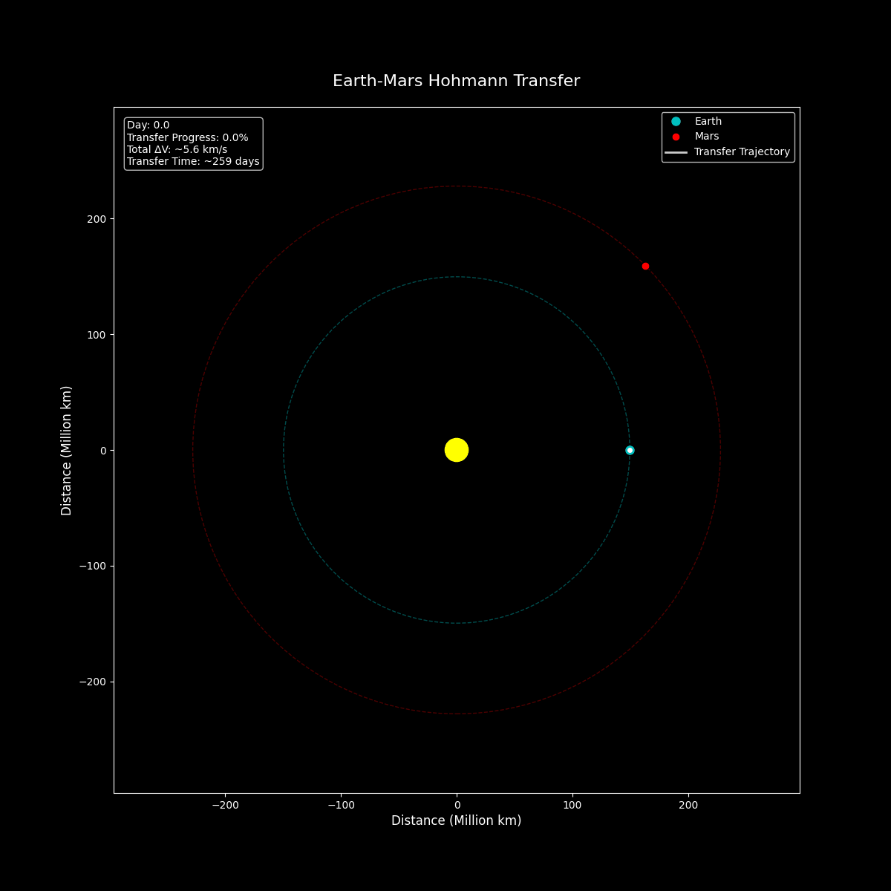
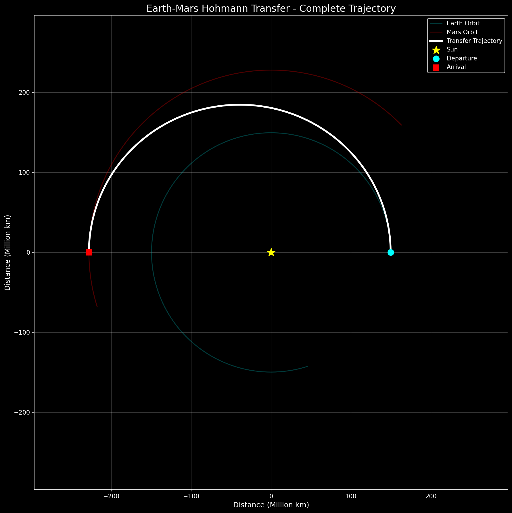
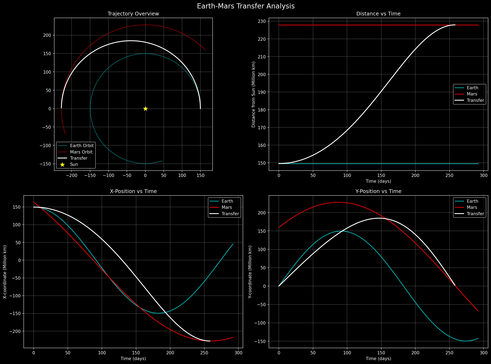
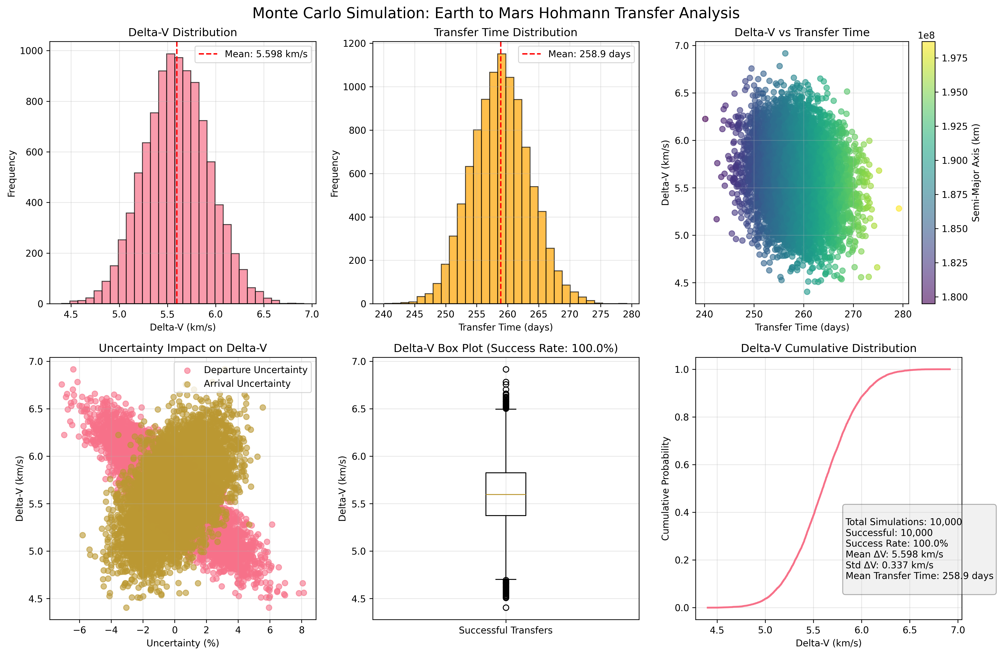
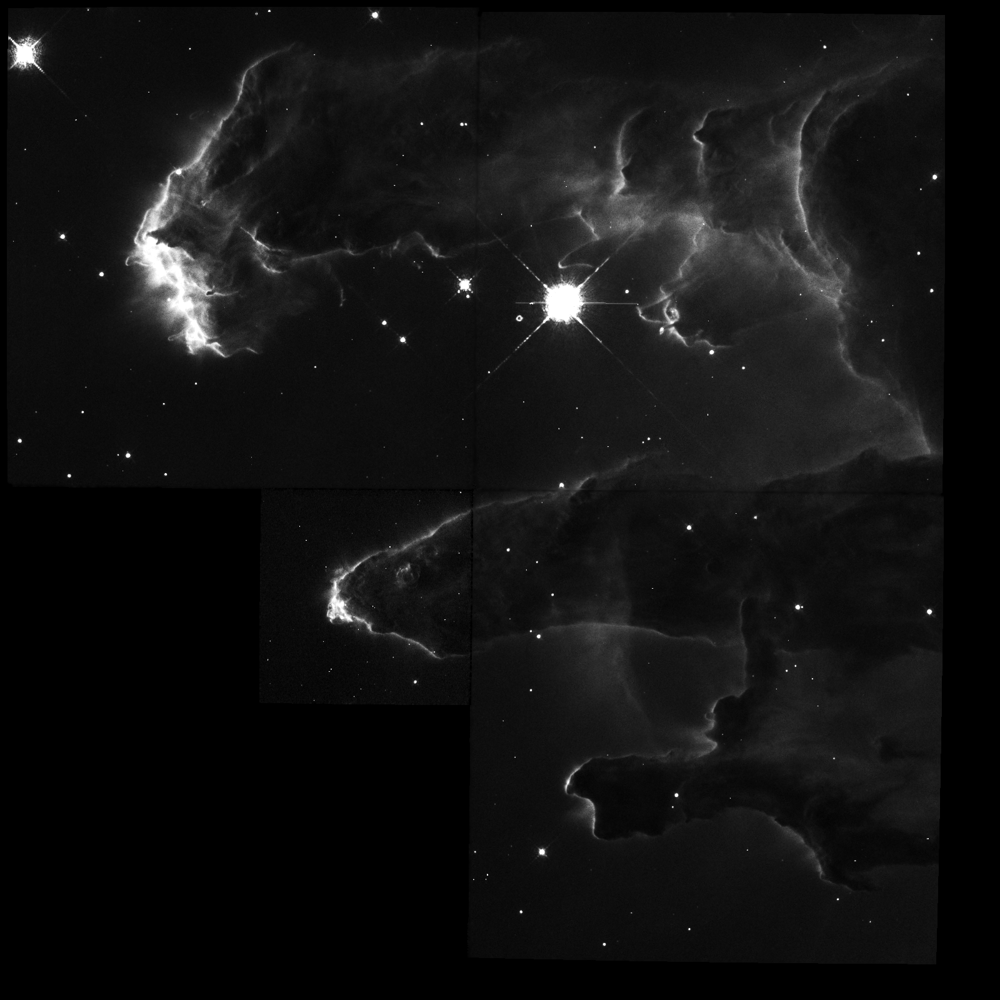

<h1 align="center">
  
</h1>

[![CI][ci-shd]][ci-url]
[![CD][cd-shd]][cd-url]
[![DC][dc-shd]][dc-url]


## Astronomical and Spacecraft Toolkit Written in Zig for Zig!

### Features / Plans

#### Spacecraft

- [x] CCSDS Packets
  - [x] CCSDS Stream Parser
- [x] VITA49 Packets
  - [x] Vita49 Stream Parser
- [x] TLE Support
  - [x] Orbital Propagation
    - [x] RK4
  - [x] Orbital Maneuvers
    - [x] Impulse Maneuvers
    - [x] Phase Maneuvers
    - [x] Plane Change Maneuvers
- [x] Orientation Determination

#### Astronomical

- [x] Astronomical References
  - [x] J2000 and JD
  - [x] Celestial Bodies
    - [x] Mass
    - [x] Radius
    - [x] Orbital Details
- [x] Astronomical Coordinates
  - [x] Equatorial Coordinate System
  - [x] World Coordinate System
- [x] Astronomical Computation
  - [x] Precession
- [x] Celestial Bodies
- [x] Orbital Mechanics
  - [x] Interplanetary Maneuvers
  - [x] Monte Carlo Simulations
- [x] FITS File Parsing
  - [x] Image Generation
    - [x] MEF Parsing
  - [x] Table Parsing

### Feature not listed ?

To request a feature, please create an issue for this project and I will try my
best to be responsive.

### Usage

- Add `astroz` as a dependency in your `build.zig.zon`.

```sh
zig fetch --save https://github.com/ATTron/astroz/archive/<git_tag_or_commit_hash>.tar.gz
#or
zig fetch --save git+https://github.com/ATTron/astroz/#HEAD
```

- Use `astroz` as a module in your `build.zig`.

```zig
const astroz_dep = b.dependency("astroz", .{
    .target = target,
    .optimize = optimize,
});
const astroz_mod = astroz_dep.module("astroz");
exe.root_module.addImport("astroz", astroz_mod);
```

### Examples

- #### [Parse TLE](examples/parse_tle.zig)

- #### [Orbit Prop for Next 3 Days](examples/orbit_prop.zig)


- #### [Orbit Prop for Next 3 Days with Impulse Maneuvers](examples/orbit_prop_impulse_manuevers.zig)


- #### [Planet Tranfer](examples/transfer_propagation.zig)

  

- #### [Monte Carlo Simulation](examples/simple_monte_carlo.zig)


- #### [Orbit Plane Change](examples/orbit_plane_change.zig)

- #### [Orbit Phase Change](examples/orbit_phase_change.zig)

- #### [Orbit Orientation Determination](examples/simple_spacecraft_orientation.zig)

- #### [Parse Vita49](examples/parse_vita49.zig)

- #### [Parse Vita49 with Callback](examples/parse_vita49_callback.zig)

- #### [Parse CCSDS from File](examples/parse_ccsds.zig)

- #### [Parse CCSDS from File with File Sync](examples/parse_ccsds_file_sync.zig)

- #### [Create CCSDS Packet](examples/create_ccsds_packet.zig)

- #### [Create CCSDS Packet with Config](examples/create_ccsds_packet_config.zig)

- #### [Generate Image from FITS File](examples/parse_fits_file.zig)



- #### [Precess star to July 30, 2005](examples/precess_star.zig)

- #### [Calculate WCS values from a TLE](examples/wcs.zig)

<!-- MARKDOWN LINKS -->

[ci-shd]: https://img.shields.io/github/actions/workflow/status/ATTron/astroz/ci.yaml?branch=main&logo=github&label=CI&labelColor=black
[ci-url]: https://github.com/ATTron/astroz/blob/main/.github/workflows/ci.yaml
[cd-shd]: https://img.shields.io/github/actions/workflow/status/ATTron/astroz/cd.yaml?branch=main&logo=github&label=CD&labelColor=black
[cd-url]: https://github.com/ATTron/astroz/blob/main/.github/workflows/cd.yaml
[dc-shd]: https://img.shields.io/badge/click-F6A516?logo=zig&logoColor=F6A516&label=doc&labelColor=black
[dc-url]: https://attron.github.io/astroz
